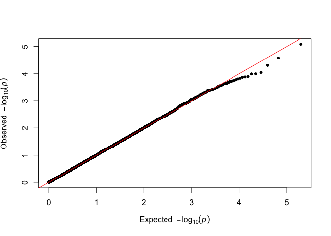

<!-- README.md is generated from README.Rmd. Please edit that file -->

# fastqq

<!-- badges: start -->
<!-- badges: end -->

`fastqq` is intended to allow users that create quantile-quantile plots.
Originally intended for large scale genome wide association studies
(GWAS). This is to investigate whether we have associations that are
stronger than what one would expect by pure randomness. In these cases,
the user often plots tens to hundreds of millions of points. Creating
scatter plots with so many points is usually not efficient, since the
graphics devices store all the data, such that the plot can be rescaled
or plotted in a vector graphics format, (where again all the data is
stored).

A better and faster approach in these cases is to note, that many of the
points are so close to each other, that there is no value in including
them in the plot. QQ style plots, are usually a monotonically increasing
sequence of points, so we can easily employ fast filtering to remove
redundant points, that would otherwise not be visible in the final plot
anyways.

We provide faster alternatives to `qqman::qq`, `stats::qqplot` and
`stats::qqnorm`. We also provide the function `fastqq::drop_dense`, such
that the user can extract the data, to plot with `ggplot`.

See examples below on how this can be achieved.

**Note** that this package is inspired by the `qqman` package, which has
now [been archived](https://github.com/stephenturner/qqman). The
interface to the `qq` function should be very similar, and `fastqq::qq`
should ideally be a drop in replacement for `qqman::qq`. I created this
package, since it could take 30-60 minutes to render a single plot with
`qqman::qq`.

## Installation

You can install the released version of `fastqq` from
[CRAN](https://CRAN.R-project.org) with:

``` r
install.packages("fastqq")
```

And the development version from [GitHub](https://github.com/) with:

``` r
# install.packages("devtools")
devtools::install_github("gumeo/fastqq")
```

## Example

The following is an example from very simple simulated data:

``` r
library(fastqq)
set.seed(42)
p_simulated <- runif(10000)
# Classic way to do this with qqman
qqman::qq(p_simulated)
```



``` r
# Alternative
fastqq::qq(p_simulated)
```


We can compare the timings of creating the plots, with `qqman`.

``` r
set.seed(555)
N_test <- c(1e3,1e4,1e5,1e6)
time_method <- function(pkg_name, method){
  suppressPackageStartupMessages(library(pkg_name, 
                                         character.only=TRUE, quietly = TRUE))
  for(N in N_test){
    p_vec <- runif(n = N)
    print(paste0("Timing ", pkg_name, "::", method," with ", 
                 N, " points"))
    tictoc::tic()
    pdf(file = NULL) # Prevent the plots from appearing
    do.call(method, list(pvector=p_vec))
    dev.off()
    tictoc::toc()  
  }
}

time_method('fastqq','qq')
#> [1] "Timing fastqq::qq with 1000 points"
#> 0.023 sec elapsed
#> [1] "Timing fastqq::qq with 10000 points"
#> 0.02 sec elapsed
#> [1] "Timing fastqq::qq with 1e+05 points"
#> 0.053 sec elapsed
#> [1] "Timing fastqq::qq with 1e+06 points"
#> 0.35 sec elapsed
time_method('qqman','qq')
#> [1] "Timing qqman::qq with 1000 points"
#> 0.003 sec elapsed
#> [1] "Timing qqman::qq with 10000 points"
#> 0.025 sec elapsed
#> [1] "Timing qqman::qq with 1e+05 points"
#> 0.242 sec elapsed
#> [1] "Timing qqman::qq with 1e+06 points"
#> 2.446 sec elapsed
```

So we can expect around 8-10X speedup.

# Note on other efforts

After I created this, I have found several sources, that aim at
something similar, usually also a **manhattan** plot (I am probably also
missing other packages):

-   [`fastman`](https://github.com/roman-tremmel/ggfastman) package.
    Uses `scattermore`, so the plotting is very fast. This package is
    not currently (31/07/2021) on CRAN.
-   [`ramwas`](https://github.com/andreyshabalin/ramwas) package. Has
    not been maintained in 2 years and is on bioconductor. This package
    is aimed for **Fast Methylome-Wide Association Study Pipeline for
    Enrichment Platforms** and the `ramwas::qqPlotFast` function is just
    a minor part of the package. It

Here are also some projects on CRAN, where the plotting is similar to
`qqman::qq`, and is not improved for speed.

-   [`gwaRs`](https://github.com/LindoNkambule/gwaRs) package. Focuses
    on using `ggplot`.
-   [`manhplot`](https://github.com/cgrace1978/manhplot) package. This
    is a pretty ambitious project, with a good
    [publication](https://bmcbioinformatics.biomedcentral.com/track/pdf/10.1186/s12859-019-3201-y.pdf).
    Again, the main focus is on the manhattan plot.
-   [`qqman`](https://github.com/stephenturner/qqman) package. Probably
    one of the main inspiration for most of the other packages.
-   [`CMplot`](https://github.com/YinLiLin/CMplot) package. Great
    circular manhattan plot.
